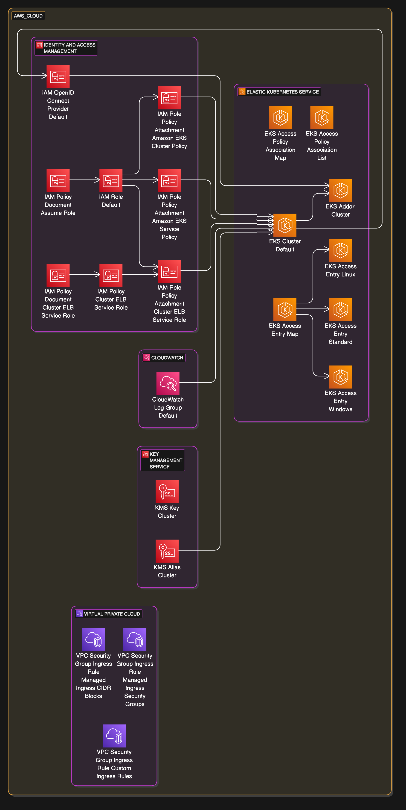

# tf-eraser (alpha)

A command-line tool that converts Terraform configuration files into Eraser DSL format for visualization.

This tool was AI-generated using the [Stakpak](https://apiv2.stakpak.dev/docs) and [Eraser](https://docs.eraser.io/reference/getting-started) API documentation.

## Example

Diagram generated from this [Terraform Cloude Possed EKS module repo](https://github.com/cloudposse/terraform-aws-eks-cluster).

```bash
git clone https://github.com/cloudposse/terraform-aws-eks-cluster.git
./tf-eraser ./terraform-aws-eks-cluster
```



## Usage

### Basic Usage

Generate Eraser Diagram-as-Code from your Terraform code.

```bash
./tf-eraser <terraform module directory>
```

### Generate Image URL

Generate Eraser Diagram-as-Code from your Terraform code. and render diagram.

Get [Eraser API Key](https://docs.eraser.io/reference/api-token)

```bash
export ERASER_API_KEY=<api key>
./tf-eraser <terraform module directory>
```
